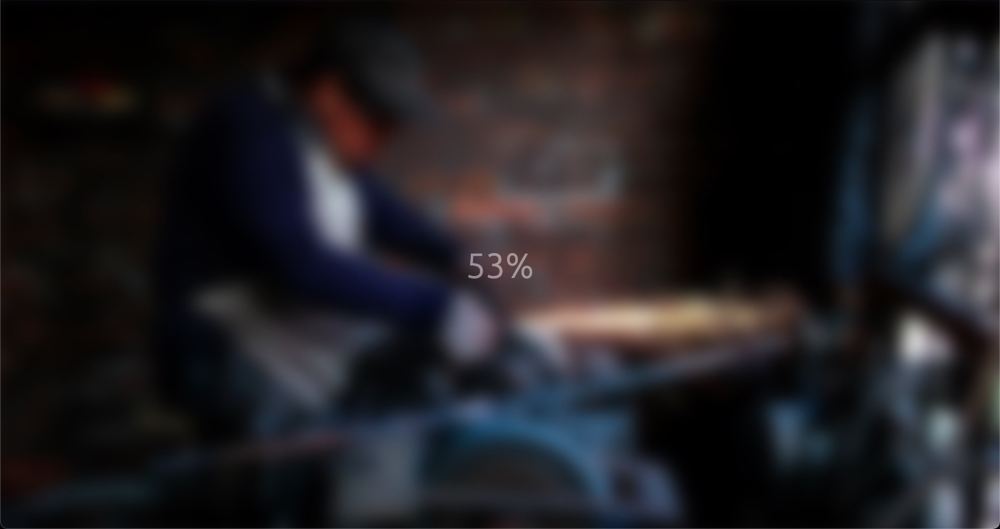

# Brad Traversy - Blurry Loading

This project was taken from  [Udemy by Brad Traversy and Florin Pop](https://www.udemy.com/course/50-projects-50-days/). Sharpen your skills by building 50 quick, unique & fun mini projects.

## Table of contents

- [Overview](#overview)
  - [Screenshot](#screenshot)
  - [Links](#links)
- [My process](#my-process)
  - [Built with](#built-with)
- [Author](#author)

## Overview

### Screenshot

### Links

- Live Site URL: [Blurry Loading](https://zoxabbasi.github.io/blurry-loading_brad-traversy/)

## My process

- Using CSS to style the page.
- Using Javascript to toggle class.

### Built with

- Semantic HTML5 markup.
- CSS custom properties.
- Javascript.

## Author

- Website - [Talal Abbasi](https://zoxabbasi.github.io/)
- Twitter - [@zoxabbasi](https://www.twitter.com/zoxabbasi)
